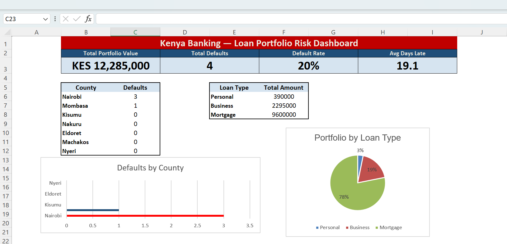

# 🏦 Kenya Banking — Loan Portfolio Risk Dashboard

##  Project Overview
Analysis of a Kenyan bank's loan portfolio identifying 
credit risk concentration and default patterns across 
counties, loan types and customer demographics.

##  Key Findings
- **Portfolio Value:** KES 12,285,000
- **Default Rate:** 20% (4 of 20 loans)
- **Nairobi** accounts for 60% of all defaults 🚨
- **Personal loans** carry 57.7% default rate
- **Mortgage** portfolio fully performing (0% defaults)
- **Average repayment delay:** 19.1 days
- **Mombasa** emerging risk — 45 avg days late ⚠️

##  Tools & Skills Demonstrated
| Skill | Application |
|---|---|
| Power Query | Automated cleaning of 3 raw data sources |
| Merge Queries | Linked Customers + Loans + Repayments |
| Pivot Tables | 4 multi-dimensional risk analyses |
| COUNTIFS/SUMIF | Dynamic KPI calculations |
| Conditional Formatting | Automated risk traffic lights |
| Dashboard Design | Executive-ready presentation |

## 📁 Project Structure
| Sheet | Purpose |
|---|---|
| RAW_Customers | Original messy customer data |
| RAW_Loans | Original messy loan data |
| RAW_Repayments | Original messy repayment data |
| Master_Portfolio | Power Query merged master dataset |
| ANALYSIS | 4 Pivot Table risk analyses |
| DASHBOARD | Executive KPI dashboard |

## 💡 Business Recommendations
1. Implement stricter credit screening for Personal loans
2. Conduct immediate Nairobi portfolio review
3. Monitor Mombasa closely — emerging default risk
4. Mortgage product strategy is working — maintain standards

## 👤 Author
**NC-Duncan** | Data Analyst
📍 Nairobi, Kenya
